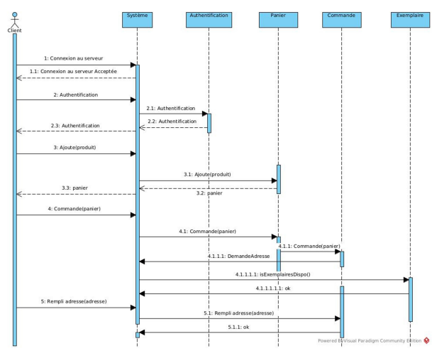
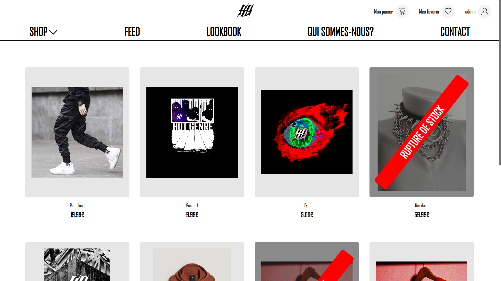
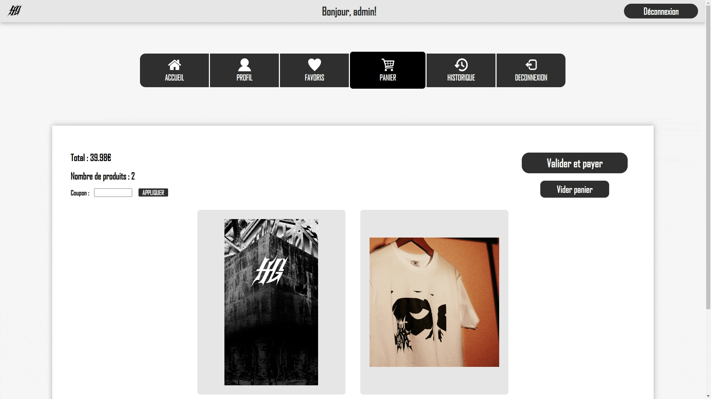
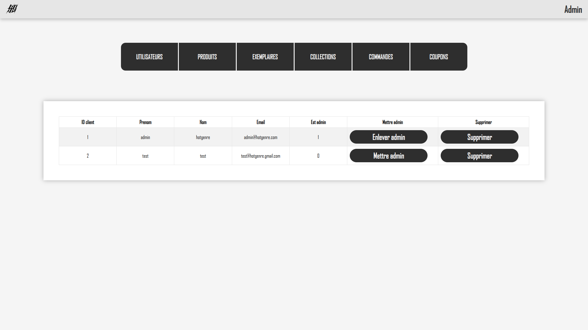
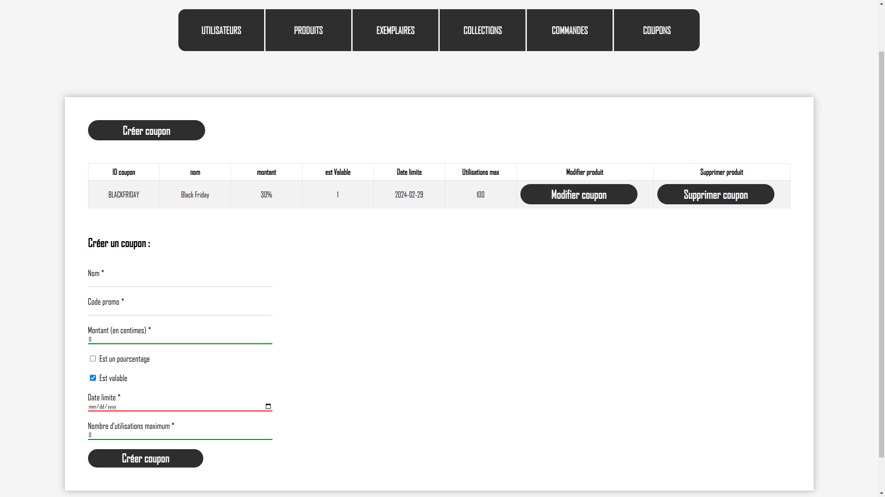
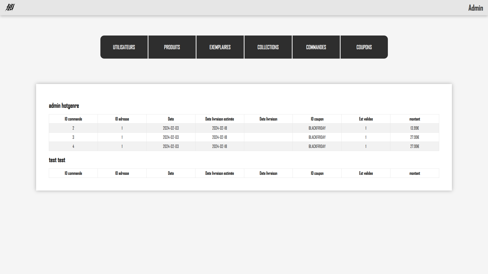

[](README.md) 

# Hot Genre


[](https://www.javascript.com/)


Hot Genre est un projet de fin de semestre réalisé par groupe de 5 pendant 2 mois en 2ème année de BUT. Pour ce projet, nous devions développer un site de vente en ligne qui devait gérer tout le processus de commande par un client, de la connexion à la validation de la commande (le paiement n'étant pas à gérer).

Le projet a été réalisé en PHP, HTML5, CSS3 et JavaScript avec le framework [CodeIgniter 4](https://www.codeigniter.com) et avec une base de données [MySQL](https://www.mysql.com/).

Afin de nous organiser au mieux, nous nous sommes répartis les tâches à l'aide de l'outil de gestion Trello.

Avant de commencer, nous avons mené une analyse des besoins et avons réalisé différents schémas nous permettant de bien comprendre le besoin et de détrerminer ce qu'il nous fallait faire.

  
*Diagramme de cas d'utilisation*

  
*Exemple de diagramme de séquence réalisé (commander)*


*Diagramme base de données*

Nous avons décidé d'utiliser CodeIgniter 4 car ce dernier est basé sur un modèle MVC (Model View Controller). Cela permet de bien séparer les différents aspects de l'application avec les contrôleurs pour le back-end, les modèles pour les accès à la base de données et les vues pour le front-end.

Les principales fonctinnalités que nous avons implémentées sont :
- Authentification
- Consultation du catalogue de produits
- Choix de la taille et de la couleur du produit
- Mise en favori des produits
- Panier
- Coupons de réduction
- Commandes
- Historique de commandes
- Tableau de bord pour administrateurs (pour gérer les comptes, produits, stocks...)
- ...

Sur ce projet, j'ai principalement travaillé sur les contrôleurs et les vues mais aussi sur l'analyse des besoins et la base de données.

Nous avons aussi réalisé des tests de performance sur différentes pages du site afin d'estimer la charge que pouvais supporter le serveur (voir le rapport [ici](Rapport_Tests_Performance.pdf))


# Installation et configuration

## Prérequis

> PHP version 8.1+
> PHP extensions : mbstring, curl, intl, xml, mysql
> MySQL

## Déploiement

Il faut tout d'abord cloner ce dépôt.

Configurer ensuite la variable `baseUrl` dans `app/Config/App.php` pour indiquer l'hôte et le port voulu

Puis, créer une base de données avec MySQL :
```sql
CREATE DATABASE database_name;
USE database_name;
```
Et exécuter les trois scripts SQL dans `app/Database/Seeds` :
```sql
source PATH/TO/create_tables.sql
source PATH/TO/create_procedures.sql
source PATH/TO/create_triggers.sql
```

Après cela, configurer la variable `default` du fichier `app/Config/Database.php` en y indiquant le `username` et le `password` de l'utilisateur pour se connecter à la bd et le nom de la base de données dans `database`.


Pour démarrer le serveur, exécuter :
```
php spark serve
```

Pour avoir accès aux fonctionnalités administrateurs du site, il faut créer un utilisateur (grâce au bouton Inscription) puis manuellement le mettre adminstrateur depuis la base de données avec la commande :
```sql
UPDATE Client SET set_admin = 1 WHERE id_client = 1;
```
Cela n'est à faire que la première fois et peut ensuite être fait depuis la page administrateur de ce compte.


# Screenshots

  
*Page d'accueil*

  
*Création de compte*

  
*Liste des produits*

  
*Ajout de produit au panier*

  
*Confirmation de commande*

  
*Récapitulatif de commande*

  
*Profil*

  
*Page administrateur - Gestion des comptes*

  
*Page administrateur - Gestion des produits*

  
*Page administrateur - Gestion des stocks*

  
*Page administrateur - Gestion des coupons de rédution*

  
*Page administrateur - Historique des commandes*


# Contact

Email: [quentin.chauvelon@gmail.com](mailto:quentin.chauvelon@gmail.com) 

LinkedIn: [Quentin Chauvelon](https://www.linkedin.com/in/quentin-chauvelon/) 