# Équipe 1-3

## Informations de connexion
IP: `172.26.82.56`
Pass: `c8PFN69nv7mV`
Mot de pass root : `manoir`

## Diagramme de classes SQL

```mermaid
classDiagram
direction BT
class Accessoire {
 int(11) id_produit
 int(11) id_collection
 varchar(100) nom
 int(11) prix
 int(11) reduction
 varchar(500) description
 varchar(50) categorie
}
class Admin
class Client {
 varchar(255) adresse_email
 varchar(255) nom
 varchar(64) prenom
 varchar(64) password
 tinyint(1) est_admin
 int(11) id_client
}
class Collection {
 varchar(50) nom
 date parution
 date date_limite
 int(11) id_collection
}
class Commande {
 int(11) id_client
 date date_commande
 date date_livraison_estimee
 date date_livraison
 varchar(20) id_coupon
 int(11) id_commande
}
class Coupon {
 varchar(50) nom
 int(11) montant
 tinyint(1) est_pourcentage
 tinyint(1) est_valable
 date date_limite
 int(11) utilisations_max
 varchar(20) code
}
class CouponValable {
 varchar(20) code
 varchar(50) nom
 int(11) montant
 tinyint(1) est_pourcentage
 tinyint(1) est_valable
 date date_limite
 int(11) utilisations_max
}
class Exemplaire {
 int(11) id_produit
 int(11) id_commande
 date date_obtention
 tinyint(1) est_disponible
 varchar(50) taille
 varchar(20) couleur
 int(11) id_exemplaire
}
class ExemplaireDispo {
 int(11) id_exemplaire
 int(11) id_produit
 int(11) id_commande
 date date_obtention
 tinyint(1) est_disponible
 varchar(50) taille
}
class Favori {
 int(11) id_client
 int(11) id_produit
}
class Fidele {
 int(11) id_client
 varchar(255) adresse_email
 varchar(255) nom
 varchar(64) prenom
 varchar(64) password
 tinyint(1) est_admin
}
class Pantalon {
 int(11) id_produit
 int(11) id_collection
 varchar(100) nom
 int(11) prix
 int(11) reduction
 varchar(500) description
 varchar(50) categorie
}
class Poster {
 int(11) id_produit
 int(11) id_collection
 varchar(100) nom
 int(11) prix
 int(11) reduction
 varchar(500) description
 varchar(50) categorie
}
class Produit {
 int(11) id_collection
 varchar(100) nom
 int(11) prix
 int(11) reduction
 varchar(500) description
 varchar(50) categorie
 date parution
 int(11) id_produit
}
class ProduitReduction {
 int(11) id_produit
 int(11) id_collection
 varchar(100) nom
 int(11) prix
 int(11) reduction
 varchar(500) description
 varchar(50) categorie
}
class Sweat {
 int(11) id_produit
 int(11) id_collection
 varchar(100) nom
 int(11) prix
 int(11) reduction
 varchar(500) description
 varchar(50) categorie
}
class Tshirt {
 int(11) id_produit
 int(11) id_collection
 varchar(100) nom
 int(11) prix
 int(11) reduction
 varchar(500) description
 varchar(50) categorie
}
class Vetement {
 int(11) id_produit
 int(11) id_collection
 varchar(100) nom
 int(11) prix
 int(11) reduction
 varchar(500) description
 varchar(50) categorie
}

Commande --> Client : id_client
Commande --> Coupon : id_coupon
Exemplaire --> Commande : id_commande
Exemplaire --> Produit : id_produit
Favori --> Client : id_client
Favori --> Produit : id_produit
Produit --> Collection : id_collection
```

## Triggers SQL
- `coupon_trop_utilise_insert`
- `coupon_trop_utilise_update`
- `coupon_expire_insert`
- `coupon_expire_update`
- `coupon_non_valable_insert`
- `coupon_non_valable_update`