# Équipe 1-3

## Informations de connexion
* IP : `172.26.82.56`
* Pass : `c8PFN69nv7mV`
* Mot de pass root : `manoir`

## Diagramme de classes SQL

```mermaid
classDiagram
direction BT
class Adresse {
   int(11) code_postal
   varchar(100) ville
   varchar(100) rue
   int(11) id_adresse
}
class Client {
   varchar(255) adresse_email
   varchar(255) nom
   varchar(64) prenom
   varchar(64) password
   tinyint(1) est_admin
   int(11) id_client
}
class Collection {
   varchar(50) nom
   date parution
   date date_limite
   int(11) id_collection
}
class Commande {
   int(11) id_client
   int(11) id_adresse
   date date_commande
   date date_livraison_estimee
   date date_livraison
   varchar(20) id_coupon
   tinyint(1) est_validee
   int(11) montant
   int(11) id_commande
}
class Coupon {
   varchar(50) nom
   int(11) montant
   tinyint(1) est_pourcentage
   tinyint(1) est_valable
   date date_limite
   int(11) utilisations_max
   varchar(20) id_coupon
}
class Exemplaire {
   int(11) id_produit
   int(11) id_commande
   date date_obtention
   tinyint(1) est_disponible
   varchar(3) taille
   varchar(20) couleur
   int(11) id_exemplaire
}
class Favori {
   int(11) id_client
   int(11) id_produit
}
class Produit {
   int(11) id_collection
   varchar(100) nom
   int(11) prix
   int(11) reduction
   varchar(500) description
   varchar(50) categorie
   date parution
   int(11) id_produit
}
class Taille {
   varchar(10) categorie
   varchar(3) taille
}
class accessoire {
   int(11) id_produit
   int(11) id_collection
   varchar(100) nom
   int(11) prix
   int(11) reduction
   varchar(500) description
   varchar(50) categorie
   date parution
}
class admin {
   int(11) id_client
   varchar(255) adresse_email
   varchar(255) nom
   varchar(64) prenom
   varchar(64) password
   tinyint(1) est_admin
}
class couponvalable {
   varchar(20) id_coupon
   varchar(50) nom
   int(11) montant
   tinyint(1) est_pourcentage
   tinyint(1) est_valable
   date date_limite
   int(11) utilisations_max
}
class exemplairedispo {
   int(11) id_exemplaire
   int(11) id_produit
   int(11) id_commande
   date date_obtention
   tinyint(1) est_disponible
   varchar(3) taille
   varchar(20) couleur
}
class fidele {
   int(11) id_client
   varchar(255) adresse_email
   varchar(255) nom
   varchar(64) prenom
   varchar(64) password
   tinyint(1) est_admin
}
class pantalon {
   int(11) id_produit
   int(11) id_collection
   varchar(100) nom
   int(11) prix
   int(11) reduction
   varchar(500) description
   varchar(50) categorie
   date parution
}
class poster {
   int(11) id_produit
   int(11) id_collection
   varchar(100) nom
   int(11) prix
   int(11) reduction
   varchar(500) description
   varchar(50) categorie
   date parution
}
class produitreduction {
   int(11) id_produit
   int(11) id_collection
   varchar(100) nom
   int(11) prix
   int(11) reduction
   varchar(500) description
   varchar(50) categorie
   date parution
}
class sweat {
   int(11) id_produit
   int(11) id_collection
   varchar(100) nom
   int(11) prix
   int(11) reduction
   varchar(500) description
   varchar(50) categorie
   date parution
}
class tshirt {
   int(11) id_produit
   int(11) id_collection
   varchar(100) nom
   int(11) prix
   int(11) reduction
   varchar(500) description
   varchar(50) categorie
   date parution
}
class vetement {
   int(11) id_produit
   int(11) id_collection
   varchar(100) nom
   int(11) prix
   int(11) reduction
   varchar(500) description
   varchar(50) categorie
   date parution
}

Commande  -->  Adresse : id_adresse
Commande  -->  Client : id_client
Commande  -->  Coupon : id_coupon
Exemplaire  -->  Commande : id_commande
Exemplaire  -->  Produit : id_produit
Exemplaire  -->  Taille : taille
Favori  -->  Client : id_client
Favori  -->  Produit : id_produit
Produit  -->  Collection : id_collection

```

## Triggers SQL
* `coupon_trop_utilise_insert`
* `coupon_trop_utilise_update`
* `coupon_expire_insert`
* `coupon_expire_update`
* `coupon_non_valable_insert`
* `coupon_non_valable_update`
* `supprimer_client_cascade`
* `exemplaire_pas_dispo_commande` Met est_dispo à false quand on ajoute à une commande
* `suppression_commande_liberer_exemplaire` Met dispo à true quand on supprime une commande
* `suppression_collection`
* `categorie_produit_invalide_insert`
* `categorie_produit_invalide_update`
* `taille_valide_insert`
* `taille_valide_update`
* `update_commande_validee`
* `commande_validee_mauvaise`

## Procédures SQL
### Table Client
- `GetAllClients()`
- `GetClientParID(ID)`
- `GetClientParEmail(email)`
- `GetAllAdmins()`
- `GetAllFideles()`
- `CreerClient(mail, nom, prenom, password)` Pas admin par défaut
- `ModifierClient(id, mail, nom, prenom, password, admin)`
- `SupprimerClient(id)`

### Table Collection
- `CreerCollection(nom)` Parution aujourd'hui et pas de date limite par défaut
- `ModifierCollection(id, nom, parution, date_limite)`
- `GetAllCollections()`
- `GetCollectionParId(id)`
- `GetCollectionParNom(nom)`
- `GetCollectionsActuelles()`
- `GetCollectionsEphemeresActuelles()`
- `SupprimerCollection(id)`

### Table Coupon
- `CreerCoupon(id_coupon, nom, montant, est_pourcentage, est_valable)` Pas de date limite ni de nombre d'utilisations max par défaut.
- `ModifierCoupon(id_coupon, nom, montant, est_pourcentage, est_valable, date_limite, utilisations_max)`
- `GetAllCoupons()`
- `GetAllCouponsValables()`
- `GetCouponParId(id_coupon)`
- `NombreUtilisationsCoupon(id_coupon)`
- `GetAllCouponsNonExpires()
- `GetAllCouponsUtilisables()`
- `SupprimerCoupon(id_coupon)`

### Table Produit
- `CreerProduit(nom, prix, description, categorie)`
- `GetAllProduits()`
- `GetAllProduitsReduction()`
- `GetProduitParId(id_produit)`
- `ModifierProduit(id_produit, nom, prix, description, categorie, parution, reduction, id_collection)`
- `SupprimerProduit(id_produit)`
- `GetAllPantalons()`
- `GetAllSweats()`
- `GetAllTshirts()`
- `GetAllVetements()`
- `GetAllPosters()`
- `GetAllAccessoires()`
- `GetAllProduitsDispo()`

### Table Favori
- `CreerFavori(id_client, id_produit)`
- `SupprimerFavori(id_client, id_produit)`
- `GetAllFavoris()`
- `GetFavorisClient(id_client)`
- `ProduitsPlusFavoris()`

### Table Exemplaire
- `CreerExemplaire(id_produit, couleur, taille)`
- `SupprimerExemplaire(id_exemplaire)`
- `ModifierExemplaire(id_exemplaire, id_produit, couleur, taille, est_disponible, date_obtention, id_commande)`
- `GetAllExemplaires()`
- `GetAllExemplairesDispo()`
- `GetExemplaireParId(id_exemplaire)`
- `GetExemplairesParProduit(id_produit)`
- `GetExemplairesDispoParProduit(id_produit)`
- `GetExemplairesParProduitCouleurTaille(id_produit, couleur, taille)`
- `GetExemplairesDispoParProduitCouleurTaille(id_produit, couleur, taille)`

### Table Commande
- `CreerCommande(id_client)`
- `ModifierCommande(id_commande, id_client, date_commande, date_livraison_estimee, date_livraison, id_coupon, est_validee, montant, id_adresse)`
- `SupprimerCommande(id_commande)`
- `GetAllCommandes()`
- `GetCommandeParId(id_commande)`
- `GetContenuCommande(id_commande)`
- `CalculerMontant(id_commande)`

### Table Adresse
- `CreerAdresse(code_postal, ville, rue)`
- `ModifierAdresse(id_adresse, ville, code_postal, rue)`
- `SupprimerAdresse(id_adresse)`
- `GetAllAdresses()`
- `GetAdressesParCodePostal(code_postal)`
- `GetAdresseParId(id_adresse)`
- `GetAdressesParClient(id_client)`

### Table Taille
- `GetAllTailles()`
- `GetCategorieParTaille(taille)`
- `GetTaillesParCategorie(categorie)`
- `GetTaillesPoster()`
- `GetTaillesVetement()`