[](README.fr.md) 

# Hot Genre


[](https://www.javascript.com/)


Hot Genre is our end of term project we worked on as a group of 5 for 2 months during my second year of BUT in Computer Science. For this project, we had to develop an online shopping website from client authentification to order confirmation (payement was not to be handled)

The project has been developed in PHP, HTML5, CSS3 et JavaScript with the  [CodeIgniter 4](https://www.codeigniter.com) framework and a [MySQL](https://www.mysql.com/) database.

To organize ourselves, we divided the tasks among us using a planning tool: Trello.

Prior to starting development, we analyzed the requirements and made multiple diagrams to fully understand the needs and knowing what we had to do.

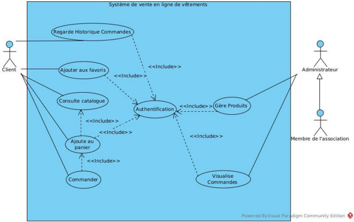  
*Use case diagram*

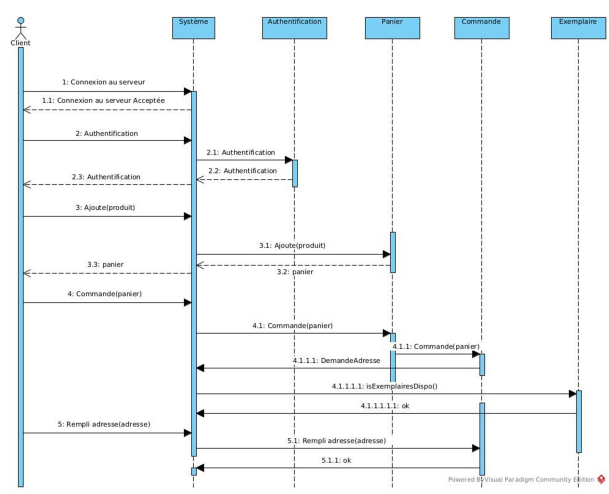  
*Example of one of the sequence diagram we made (Order)*


```mermaid
classDiagram
direction BT
class Adresse {
   int(11) code_postal
   varchar(100) ville
   varchar(100) rue
   int(11) id_adresse
}
class Client {
   varchar(255) adresse_email
   varchar(255) nom
   varchar(64) prenom
   varchar(64) password
   tinyint(1) est_admin
   int(11) id_client
}
class Collection {
   varchar(50) nom
   date parution
   date date_limite
   int(11) id_collection
}
class Commande {
   int(11) id_client
   int(11) id_adresse
   date date_commande
   date date_livraison_estimee
   date date_livraison
   varchar(20) id_coupon
   tinyint(1) est_validee
   int(11) montant
   int(11) id_commande
}
class Coupon {
   varchar(50) nom
   int(11) montant
   tinyint(1) est_pourcentage
   tinyint(1) est_valable
   date date_limite
   int(11) utilisations_max
   varchar(20) id_coupon
}
class Exemplaire {
   int(11) id_produit
   int(11) id_commande
   date date_obtention
   tinyint(1) est_disponible
   varchar(3) taille
   varchar(20) couleur
   int(11) id_exemplaire
}
class Favori {
   int(11) id_client
   int(11) id_produit
}
class Produit {
   int(11) id_collection
   varchar(100) nom
   int(11) prix
   int(11) reduction
   varchar(500) description
   varchar(50) categorie
   date parution
   int(11) id_produit
}
class Taille {
   varchar(10) categorie
   varchar(3) taille
}
class accessoire {
   int(11) id_produit
   int(11) id_collection
   varchar(100) nom
   int(11) prix
   int(11) reduction
   varchar(500) description
   varchar(50) categorie
   date parution
}
class admin {
   int(11) id_client
   varchar(255) adresse_email
   varchar(255) nom
   varchar(64) prenom
   varchar(64) password
   tinyint(1) est_admin
}
class couponvalable {
   varchar(20) id_coupon
   varchar(50) nom
   int(11) montant
   tinyint(1) est_pourcentage
   tinyint(1) est_valable
   date date_limite
   int(11) utilisations_max
}
class exemplairedispo {
   int(11) id_exemplaire
   int(11) id_produit
   int(11) id_commande
   date date_obtention
   tinyint(1) est_disponible
   varchar(3) taille
   varchar(20) couleur
}
class fidele {
   int(11) id_client
   varchar(255) adresse_email
   varchar(255) nom
   varchar(64) prenom
   varchar(64) password
   tinyint(1) est_admin
}
class pantalon {
   int(11) id_produit
   int(11) id_collection
   varchar(100) nom
   int(11) prix
   int(11) reduction
   varchar(500) description
   varchar(50) categorie
   date parution
}
class poster {
   int(11) id_produit
   int(11) id_collection
   varchar(100) nom
   int(11) prix
   int(11) reduction
   varchar(500) description
   varchar(50) categorie
   date parution
}
class produitreduction {
   int(11) id_produit
   int(11) id_collection
   varchar(100) nom
   int(11) prix
   int(11) reduction
   varchar(500) description
   varchar(50) categorie
   date parution
}
class sweat {
   int(11) id_produit
   int(11) id_collection
   varchar(100) nom
   int(11) prix
   int(11) reduction
   varchar(500) description
   varchar(50) categorie
   date parution
}
class tshirt {
   int(11) id_produit
   int(11) id_collection
   varchar(100) nom
   int(11) prix
   int(11) reduction
   varchar(500) description
   varchar(50) categorie
   date parution
}
class vetement {
   int(11) id_produit
   int(11) id_collection
   varchar(100) nom
   int(11) prix
   int(11) reduction
   varchar(500) description
   varchar(50) categorie
   date parution
}

Commande  -->  Adresse : id_adresse
Commande  -->  Client : id_client
Commande  -->  Coupon : id_coupon
Exemplaire  -->  Commande : id_commande
Exemplaire  -->  Produit : id_produit
Exemplaire  -->  Taille : taille
Favori  -->  Client : id_client
Favori  -->  Produit : id_produit
Produit  -->  Collection : id_collection
admin --> Client : id_client
couponvalable --> Coupon : id_coupon
accessoire --> Produit : id_produit
accessoire --> Collection : id_collection
exemplairedispo --> Exemplaire : id_exemplaire
exemplairedispo --> Produit : id_produit
exemplairedispo --> Commande : id_commande
fidele --> Client : id_client
pantalon --> Produit : id_produit
pantalon --> Collection : id_collection
poster --> Produit : id_produit
poster --> Collection : id_collection
produitreduction --> Produit : id_produit
produitreduction --> Collection : id_collection
sweat --> Produit : id_produit
sweat --> Collection : id_collection
tshirt --> Produit : id_produit
tshirt --> Collection : id_collection
vetement --> Produit : id_produit
vetement --> Collection : id_collection
```
*Database diagram*

We decided to use CodeIgniter 4 because it uses a MVC pattern. This allows us to separate the aspects of our applications. Controllers handle the back-end, models handle database access and views are used for the front-end.

The main features we developed are:
- Authentification
- Consultation of available products
- Product size and color selection
- Favorite products
- Cart
- Vouchers
- Orders
- Orders history
- Dashboard for administrators (to manage accounts, products, stocks...)
- ...


For this project, I primarly worked on controllers and views but also on the requirements analysis and the database.

We also tested the performance of multiple pages of our website to estimate the load the server could handle (see the report [here](Rapport_Tests_Performance.pdf))


# Installation and setup

## Prerequesites

> PHP version 8.1+

> PHP extensions : mbstring, curl, intl, xml, mysql

> MySQL

## Deployment

First, clone this repository

Then, configure the `baseUrl` variable in the `app/Config/App.php` file with the host and port you wish to use.

After that, create a MySQL database:
```sql
CREATE DATABASE database_name;
USE database_name;
```
And execute the three SQL scripts inside `app/Database/Seeds`:
```sql
source PATH/TO/create_tables.sql
source PATH/TO/create_procedures.sql
source PATH/TO/create_triggers.sql
```

Next, configure the `default` variable in the `app/Config/Database.php` file by modifying `username` and `password` with the username and password you would use to connect to the databse, and the name of the database in `database`.


To start the server, execute :
```
php spark serve
```

To access administrators features on the website, you must first create a user (with the Sign up button), then manually make it administrator from MySQL by running the command:
```sql
UPDATE Client SET set_admin = 1 WHERE id_client = 1;
```
This has to be done only once and can then be done from the administrator dashboard.


# Screenshots

  
*Home screen*

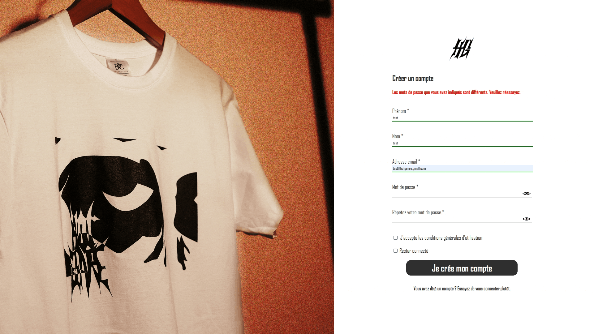  
*Sign up*

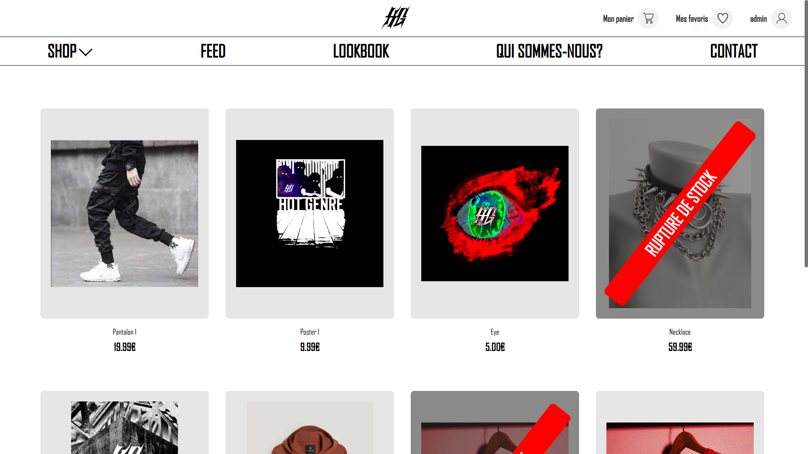  
*Products listing*

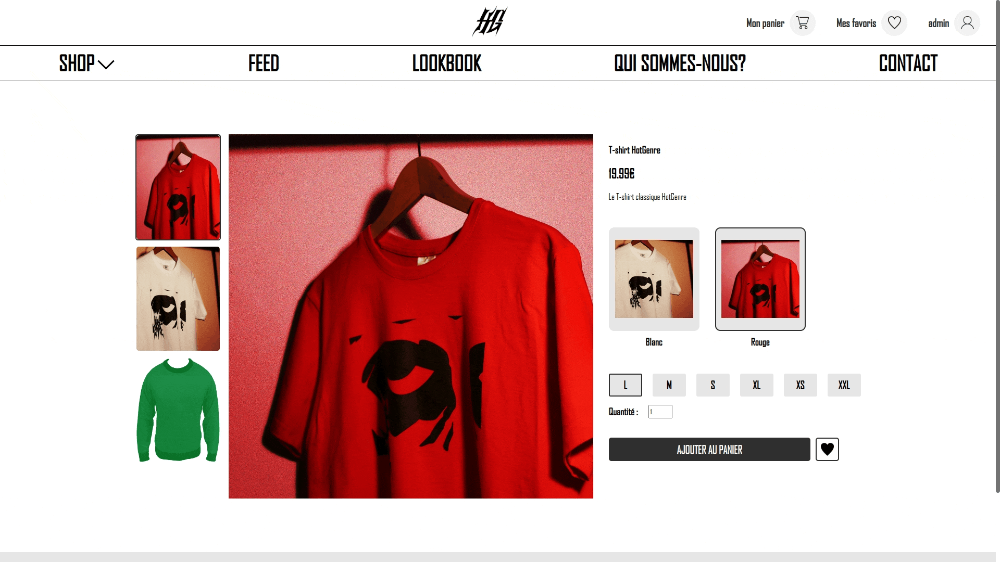  
*Add product to cart*

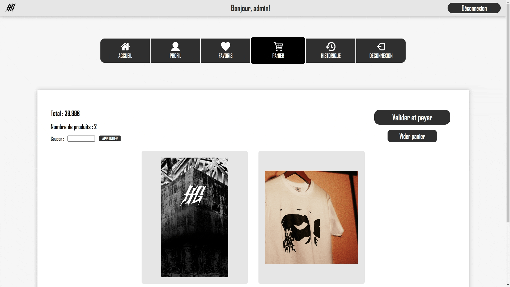  
*Confirm order*

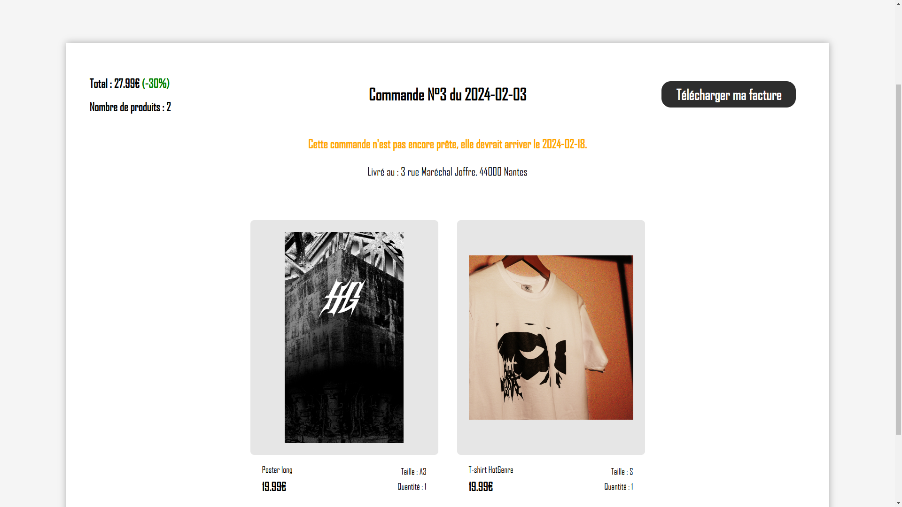  
*Order recap*

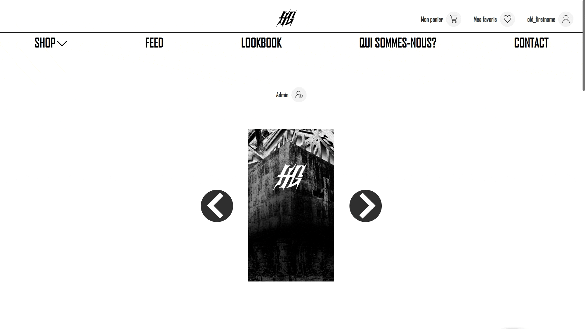  
*Profile*

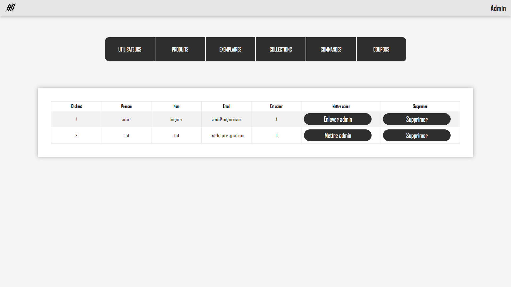  
*Administrator dashboard - Account management*

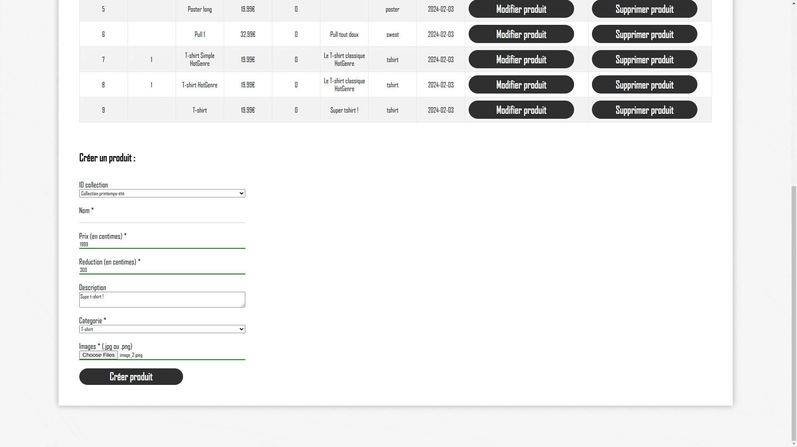  
*Administrator dashboard - Products management*

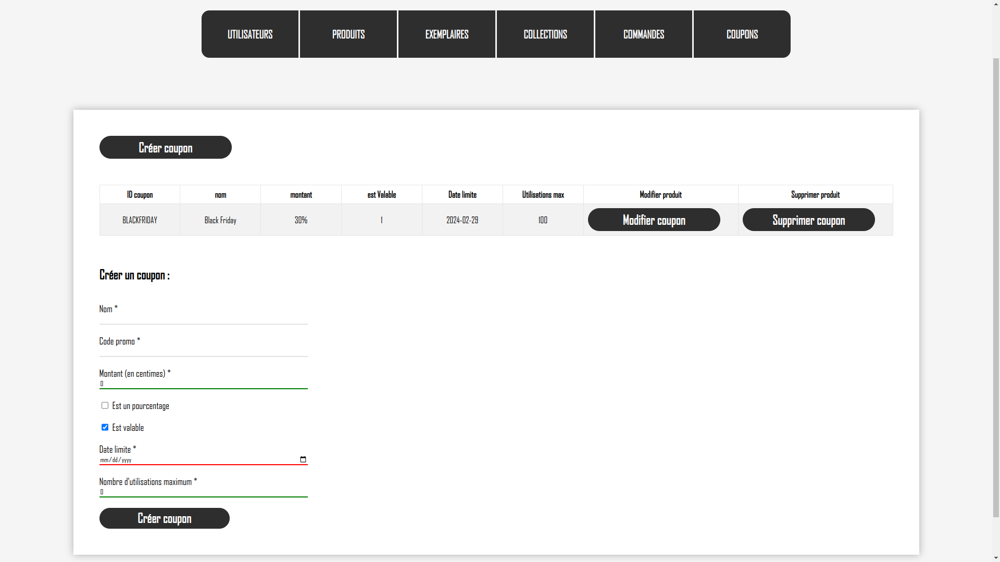  
*Administrator dashboard - Stock management*

  
*Administrator dashboard - Vouchers management*

  
*Administrator dashboard - Orders history*


# Contact

Email: [quentin.chauvelon@gmail.com](mailto:quentin.chauvelon@gmail.com) 

LinkedIn: [Quentin Chauvelon](https://www.linkedin.com/in/quentin-chauvelon/) 